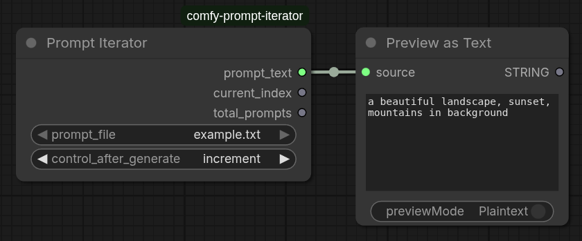

# Comfy Prompt Iterator — ComfyUI Custom Node

A ComfyUI node that automatically steps through prompts in a text file on each generation run, so you can test multiple prompt variations without touching the graph between runs.

https://www.theoath.studio/projects/comfy-prompt-iterator


---

## Install

```bash
cp ComfyUI/custom_nodes/
git clone git@github.com:OATH-Studio/comfy-prompt-iterator.git
# restart ComfyUI
```

The node appears in the node browser under **utils/prompt → Prompt Iterator**.

---

## Inputs

| Input | Type | Description |
|-------|------|-------------|
| `prompt_file` | Dropdown | The text file containing prompts (one per line) from prompt_texts folder |
| `control_after_generate` | Dropdown | How to advance the prompt selection after each run |

---

## Outputs

| Output | Type | Description |
|--------|------|-------------|
| `prompt_text` | STRING | The current prompt text (useful for connecting to PromptString nodes) |
| `current_index` | INT | One-based index of the current prompt in the file |
| `total_prompts` | INT | Total prompts in the selected file |

---

## control_after_generate

This is the key feature. After each generation completes, the node advances
its internal prompt selection according to the chosen mode:

| Mode | Behaviour |
|------|-----------|
| `fixed` | Always uses the same prompt — nothing changes between runs |
| `increment` | Moves forward one prompt each run. Wraps back to 0 after the last one |
| `decrement` | Moves backward one prompt each run. Wraps to the last one after index 0 |
| `randomize` | Picks a random prompt from the list each run |

**Example:** You have 10 prompts in your `variations.txt` file. Set `control_after_generate` to `increment`. Queue 10 runs — each generation automatically uses the next prompt with zero manual intervention.

---

## File organisation

Create a `prompt_texts` folder **inside this custom node directory**:

```bash
ComfyUI/custom_nodes/comfy-prompt-iterator/prompt_texts/
    base_prompts.txt
        a beautiful portrait of a woman, detailed face, cinematic lighting
        a beautiful landscape, sunset, mountains in background
    variations.txt
        add blur effect to the image
        add grainy film texture
        add vibrant colors and high contrast
```

### Adding your own prompt files

1. Create a new `.txt` file inside `prompt_texts/` (e.g., `my_prompts.txt`)
2. Add one prompt per line:
   ```
   first prompt variation here
   second prompt variation here
   third prompt variation here
   ```
3. Empty lines are automatically ignored
4. Restart ComfyUI or refresh the node list to see new files in the dropdown

Each `.txt` file should contain one prompt per line. The node will read all `.txt` files from `prompt_texts/` and display them in a dropdown.

---

## Typical workflow

```
Prompt Iterator → Prompt (or CLIPTextEncode) → KSampler → SaveImage
      ↑
  set control_after_generate = increment
  queue N runs (one per prompt variation)
```

Connect the `prompt_text` output to a **Prompt** node or directly to a **CLIPTextEncode** node's text input. This lets you automatically test multiple prompts without manually changing them between generations.

---

## Using with filename prefix

Combine with a Filename Prefix node to organize outputs:

```
Filename Prefix (text from prompt_text output) → Save Image
```

This embeds the current prompt variation in your saved filenames for easy tracking of which prompt produced which result.

